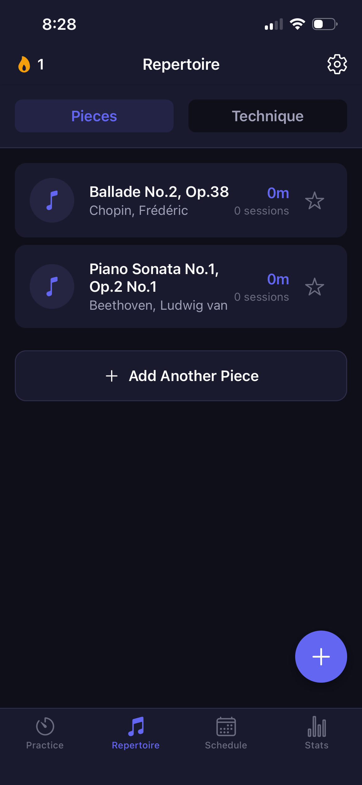
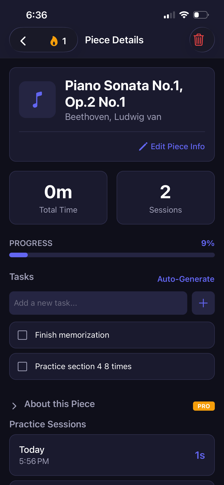

# Prasic - Smart Music Practice Companion

  
   
  <h3>Master Your Craft with AI-Powered Practice</h3>

Wusic is a modern, AI-enhanced music practice application designed to help musicians practice more effectively. Wusic also implements teacher-student interaction features, allowing teachers to assign pieces to students and monitor their progress. By combining traditional tools (Metronome, Tuner) with advanced AI analytics and structured practice plans, Wusic acts as a 24/7 pocket coach.

---

## 🚀 Key Features

### 🎓 Teacher & Student Connectivity
*Empower music education with direct feedback loops.*
- **Teacher Portal**: Teachers can invite students, view their practice logs, and monitor consistency.
- **Assignments**: Assign specific repertoire or techniques with due dates and instructions.
- **Feedback System**: Teachers can grade assignments and leave detailed feedback on student progress.

### 🎧 Smart Practice Environment
- **All-in-One Tools**: Integrated visual metronome, real-time chromatic tuner, and high-fidelity audio recorder.
- **Distraction-Free Mode**: Minimalist interface designed to keep focus on the instrument, not the screen.
- **Background Timer**: Tracks practice duration even when the phone is locked.

### 🤖 Maestro AI Coach
- **Adaptive Planning**: Generates custom daily practice routines based on your goals and recent struggle areas.
- **Vitality Score**: A proprietary 7-day rolling metric that quantifies your musical consistency.
- **Smart Analytics**: AI analyzes your session logs to suggest specific technical focus areas (e.g., "Focus on rhythm in Bar 42").
- **Tiered Intelligence**: Powered by Gemini 2.0 Flash (Free) and Gemini 2.5 Flash (Pro).

### 🎼 Repertoire & Library
- **Smart Organization**: Categorize music by Status (New, Active, Mastered) and Composer.
- **Technique Tracker**: Dedicated module for scales, arpeggios, and Hanon exercises.
- **Quick Focus Pinboard**: Keep your current pieces one tap away on the home screen.

### 📊 Professional Analytics
- **Practice Heatmaps**: Visualize your consistency with GitHub-style contribution graphs.
- **Trend Analysis**: Track practice volume, BPM progress, and session sentiment over time.

---

## 🛠️ Technology Stack

Built with a focus on performance, offline-first reliability, and smooth UX.

- **Framework**: React Native + Expo (SDK 52)
- **Navigation**: Expo Router (File-based routing)
- **Language**: TypeScript (Strict typing)
- **Database**: Local-first architecture using **Expo SQLite** + **Drizzle ORM**.
- **State Management**: Zustand (for lightweight, performant global state).
- **AI Integration**: Google Gemini API via custom MCP-style caching layer.
- **Audio Engine**: `expo-av` for playback and custom audio processing for tuner analysis.

---

## 🏗️ System Architecture

### Offline-First Design
Wusic is designed to work fully offline. All practice data, recordings, and statistics are stored locally on the device using SQLite. Syncing occurs opportunistically when online to back up data or fetch new AI insights.

### AI Caching Layer
To reduce API costs and latency, the app implements a robust caching strategy for AI responses. Practice plans and difficulty analyses are cached based on composite keys (User ID + Piece Context + Recent History), ensuring instant load times for frequent requests.

---

## 📸 Screenshots

| Screen 1 | Screen 2 |
|:---:|:---:|
|  |  |

---
